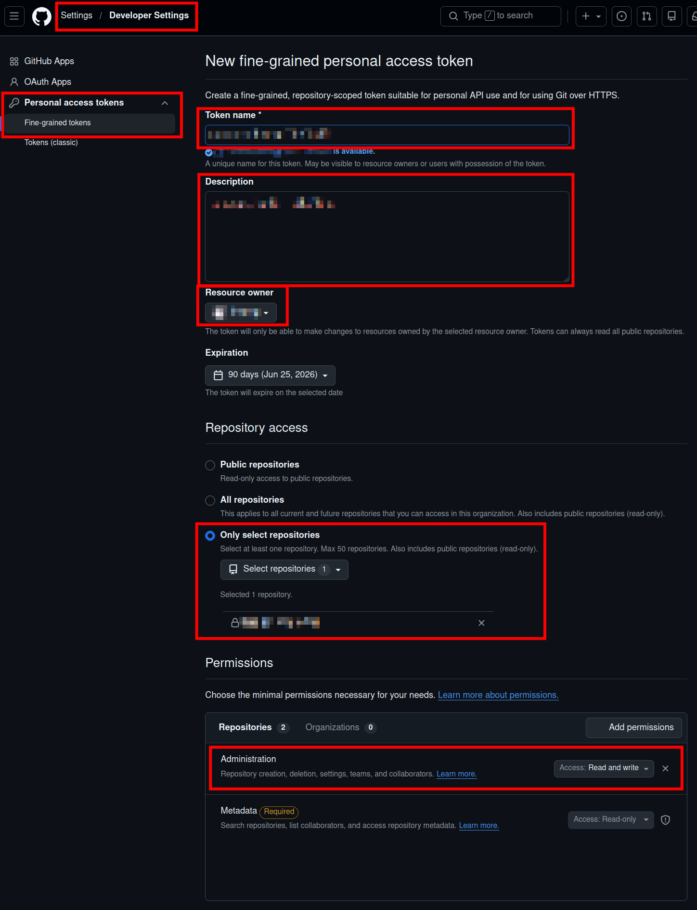

# GitHub Actions Self-hosted immutable runner

[](https://www.repostatus.org/#wip)

Tested Actions runner version: [2.322.0](https://github.com/actions/runner/releases) [2025/3/6]

----

[](https://github.com/kekyo/ga_runner/blob/main/README_ja.md)

## What is this?

GitHub Actions self-hosted runners are convenient, but have you ever thought about running them in an immutable way?

The runners hosted by GitHub are immutable, and are destroyed each time a build is run,
so you can assume a clean build environment.
However, because self-hosted runners cannot directly mimic this behavior,
it is quite troublesome to set up a clean build environment.

This script configures GitHub Actions self-hosted runners to run immutably.
It is very easy to use, and the prepared runner instance is reset each time a job is executed, which improves the reproducibility of CI/CD.

## How it works

This script has been tested on Ubuntu 24.04 host
(it is probably also compatible with recent Ubuntu and Debian, but this has not been tested).
And the runner runs based on [Ubuntu 24.04 docker image](https://hub.docker.com/_/ubuntu/).

The script installs [`podman` (an OSS implementation compatible with Docker)](https://podman.io/)
and builds a self-hosted runner instance on a container.

When the runner finishes executing the job, this container also terminates,
the container is deleted on the spot, and the container is executed again.

`podman` runs as the superuser, but runs as a normal user inside the container (you can also use `sudo`).

This series of actions is registered as a `systemd` service,
so once the host OS starts up, everything is handled automatically.

In other words, as the administrator of the host machine, you don't have to do anything! ...maybe ;)

## How to use it

The script has `sudo` inserted appropriately, so you can start working as a normal user.
We will explain the repository that wants to install the self-hosted runner as `https://github.com/kekyo/foobar`:

1. Clone `ga_runner` repository on your host machine.
   The local repository contains the scripts that `systemd` refers to.
   Since you will need to maintain the local repository after installation, please decide on a location based on that assumption:
   ```bash
   $ cd <stable_location>
   $ git clone https://github.com/kekyo/ga_runner
   ```
2. Build `podman` image (You have to run only once per the host).
   It will be installed `curl` and `podman` automatically:
   ```bash
   $ cd ga_runner
   $ ./build.sh
   ```
3. Pick your repository "Actions runner token" from GitHub.
   It is NOT "personal access token", please refer to the following screenshot:
   
   
4. Install runner service by:
   `install.sh <GitHub user name> <GitHub repository name> <Instance postfix> <Actions runner token>`. For example:
   ```bash
   $ ./install.sh kekyo foobar "" ABP************************
   ```

That's all!  ("Instance postfix" argument is specified as an empty string. Will explain this later.)

The `systemd` service is named as `github-actions-runner_kekyo_foobar`.
Therefore, to check the service in operation:

```bash
$ sudo systemctl status github-actions-runner_kekyo_foobar
```

## Storing configuration information

When runner access GitHub for the first time, you will be authenticated using your "Actions runner token".
The results of this authentication will be stored in the `scripts/config/` directory.

If something goes wrong, delete the service using `remove.sh` and start again from the beginning, obtaining a new "Actions runner token".

## Installed packages on the job container

The number of packages installed in the container is minimal.
The list is shown below:

```
sudo, tzdata, locales, curl, libxml2-utils, git, unzip, libicu-dev
```

See [Dockerfile](scripts/Dockerfile) for detail.

If necessary, you can install additional packages using `apt-get` or other tools within the Actions job YAML script.
In other words, you can control it using only the YAML script without having to rebuild the container image.

## Install multiple runner instance

Yes, you can run multiple runner instance on one host OS.
Execute `install.sh` multiple time with different user/repository name.

If you want to run multiple runner instances on the same host for the same repository, you need to specify the "Instance postfix" and run `install.sh`.

For example, to run multiple instances for the `https://github.com/kekyo/foobar` repository:

```bash
$ ./install.sh kekyo foobar "instance1" ABP************************
$ ./install.sh kekyo foobar "instance2" ABP************************
$ ./install.sh kekyo foobar "instance3" ABP************************
```

Please identify them using "Instance postfix".
As a result, the service names for `systemd` will be as follows:

* `github-actions-runner_kekyo_foobar_instance1`
* `github-actions-runner_kekyo_foobar_instance2`
* `github-actions-runner_kekyo_foobar_instance3`

These are recognized as different services.

## Package caching feature

Every time the Actions Runner is started, it downloads the latest package version
`actions-runner-linux-x64-*.tar.gz` from the official
[GitHub Actions runner release repository](https://github.com/actions/runner/releases)
and automatically caches it in the directory `scripts/runner-cache/`.
If these files are up to date, the Runner will reuse them.

The distribution files and packages for APT(Ubuntu), NPM(Node.js), .NET runtime, NuGet(.NET) and Pip(Python) are also cached.
If you think that the cached content is causing a problem, delete the files under `scripts/runner-cache/`.

## Redirect HTTP/HTTPS to the proxy server

You may want to cache the HTTP/HTTPS access that the job performs.
These can be redirected to your nearest local proxy server, which will then cache them.
This will speed up the download of packages and content.
Of course, you can also use it to get tunneling firewalls.

The URL to the proxy server is specified as the fourth optional argument to `install.sh`:

```bash
$ ./install.sh kekyo foobar "" ABP************************ http://proxy.example.com:3128
```

The URL you specify must be a valid hostname that can be accessed from within the runner container.
In other words, please note that `localhost` cannot be used.

### Using squid proxy server

Here is an example configuration for the [`squid` proxy server](https://www.squid-cache.org/) that can be used for this purpose.
This is an example of co-locating `squid` with maximum 1000MB (files each 100MB) disk cache on the machine that hosts `podman`:

```bash
$ sudo apt install squid
$ echo "http_access allow localnet" | sudo tee /etc/squid/conf.d/localnet.conf
$ echo "cache_dir ufs /var/spool/squid 1000 16 256" | sudo tee /etc/squid/conf.d/cache_dir.conf
$ echo "maximum_object_size 100 MB" | sudo tee -a /etc/squid/conf.d/cache_dir.conf
$ sudo systemctl restart squid
```

`podman` can specify the host's virtual network address by using the special `host.containers.internal` FQDN, so you can specify the URL as follows:

```bash
$ ./install.sh kekyo foobar ABP************************ http://host.containers.internal:3128
```

## Remove the runner service

`remove.sh <GitHub user name> <GitHub repository name> <Instance postfix>`. For example:

```bash
$ ./remove.sh kekyo foobar ""
```

----

## License

MIT
