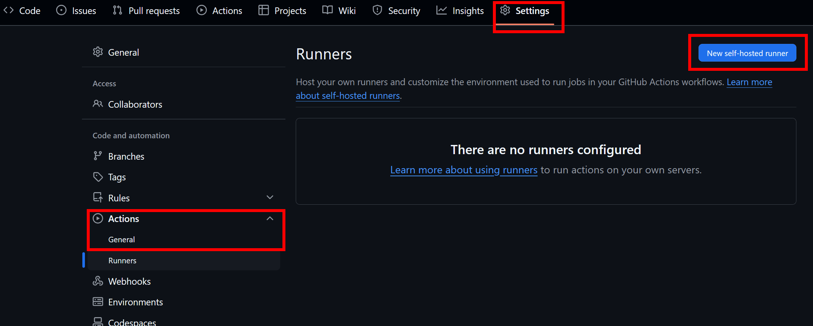
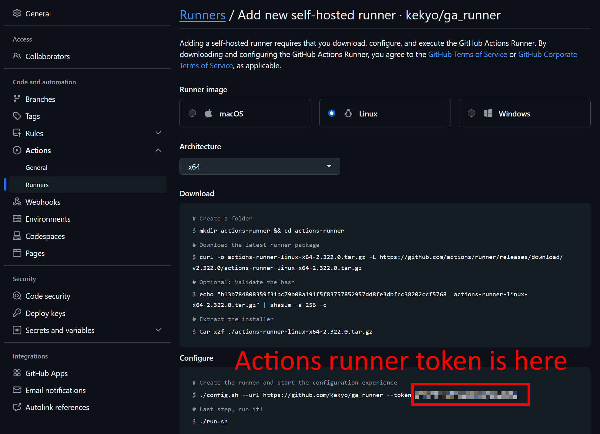

# GitHub Actions Self-hosted immutable runner

[](https://www.repostatus.org/#wip)

これはまだ作業進行中です。

Tested Actions runner version: [2.322.0](https://github.com/actions/runner/releases) [2025/3/6]

----

[English is here](README.md)

## これは何？

GitHub Actionsのセルフホストランナーは便利ですが、それをイミュータブルに実行することを考えたことはありますか？

GitHubがホストするランナーはイミュータブルであり、ビルドが実行されるたびに破棄されるため、クリーンなビルド環境を前提にすることができます。
しかし、セルフホストランナーではそうなってはいないため、クリーンなビルド環境を整えるのはかなり面倒です。

このスクリプトは、GitHub Actionsのセルフホストランナーをイミュータブル環境で実行出来るように設定します。
使い方はとても簡単で、用意されたランナーインスタンスはジョブが実行されるたびにリセットされ、CI/CDの再現性が高くなります。

## どうやって実現しているのか

このスクリプトはUbuntu 24.04ホスト上でテスト済みです
（おそらく最近のUbuntuやDebianとも互換性がありますが、これは確認されていません）。
また、ランナーは [Ubuntu 24.04のDockerイメージ](https://hub.docker.com/_/ubuntu/) 上で実行されます。

このスクリプトは [podman（Dockerと互換性のあるOSS実装）](https://podman.io/) をインストールし、
コンテナ上にセルフホストのランナーを構築します。
ランナーがジョブの実行を終えると、このコンテナも終了し、コンテナは即座に削除され、コンテナが再度新規に実行されます。

`podman`はスーパーユーザー上で動作しますが、コンテナ内では一般ユーザーで動作します（`sudo`させることもできます）。

この一連の動作は `systemd` サービスとして登録されているため、ホストOSが起動すると、すべて自動的に処理されます。

つまり、ホストマシンの管理者であるあなたは何もする必要がないのです！...多分 ;)

## 使用方法

スクリプトには適切に `sudo` が挿入されているので、一般ユーザーで作業を始めて構いません。
セルフホストランナーを導入したいリポジトリが `https://github.com/kekyo/foobar` として説明します:

1. ホストマシンに `ga_runner` リポジトリをクローンします。
   ローカルリポジトリには、`systemd` が参照するスクリプトが含まれています。
   インストール後もローカルリポジトリを維持しておく必要があるため、その前提で配置場所を決定してください:
   ```bash
   $ cd <stable_location>
   $ git clone https://github.com/kekyo/ga_runner
   ```
2. コンテナイメージをビルドします（ホストごとに1回のみ実行する必要があります）。
   これにより、`curl` と `podman` が自動的にインストールされます:
   ```bash
   $ cd ga_runner
   $ ./build.sh
   ```
3. GitHubから "Actions runner token" を取得します。
   これは "Personal access token" の事ではありません。以下のスクリーンショットを参考にしてください:
   
   
4. ランナーサービスをこのスクリプトでインストールします:
   `install.sh <GitHub user name> <GitHub repository name> <Instance postfix> <Actions runner token>`. 例えば:
   ```bash
   $ ./install.sh kekyo foobar "" ABP************************
   ```

これで終わりです！  （"Instance postfix"は空文字列を指定します。これについては後で示します。）

`systemd` サービスは `github-actions-runner_kekyo_foobar` という名前です。
そのため、稼働中のサービスを確認するには：

```bash
$ sudo systemctl status github-actions-runner_kekyo_foobar
```

ご注意: Gitローカルリポジトリには、`systemd` が参照するスクリプトが含まれています。
そのため、インストール後もローカルリポジトリを維持しておく必要があります。

## 構成情報の保存

初回GitHubアクセス時に、"Actions runner token" を使用して認証を行います。
その結果は、 `scripts/config/` 配下に格納されます。

もし動作がおかしい場合は、一旦 `remove.sh` でサービスを削除して、もう一度 "Actions runner token" の取得からやり直してください。

## ジョブコンテナにインストールされたパッケージ

コンテナにインストールされているパッケージは、最小限です。
以下にリストを示します:

```
sudo, curl, libxml2-utils, git, unzip, libicu-dev
```

詳しくは [Dockerfile](scripts/Dockerfile) を参照してください。

必要に応じて、Actions ジョブの YAML スクリプト内で `apt-get` やその他のツールを使用して追加パッケージをインストールすることができます。
つまり、コンテナイメージを再ビルドしなくても、YAMLスクリプトだけでコントロールできます。

## 複数のランナーインスタンスをインストールする

1つのホストOS上で複数のランナーインスタンスを実行できます。
異なるユーザー名/リポジトリ名で `install.sh` を複数回実行してください。

その場合でも、コンテナイメージビルダー（`build.sh`）は1回のみ実行すれば十分です。

同じリポジトリに対して、複数のランナーインスタンスを同一のホストで実行したい場合は、"Instance postfix"を指定して`install.sh`を実行する必要があります。
例えば、`https://github.com/kekyo/foobar` リポジトリに対して、複数のインスタンスを実行する場合は:

```bash
$ ./install.sh kekyo foobar "instance1" ABP************************
$ ./install.sh kekyo foobar "instance2" ABP************************
$ ./install.sh kekyo foobar "instance3" ABP************************
```

のように、"Instance postfix"で区別してください。結果として、 `systemd` のサービス名は、以下のようになります:

* `github-actions-runner_kekyo_foobar_instance1`
* `github-actions-runner_kekyo_foobar_instance2`
* `github-actions-runner_kekyo_foobar_instance3`

これらは異なるサービスとして認識されています。

## パッケージのキャッシュ

Actionsランナーは、起動されるたびに、公式の [GitHub Actions runner release repository](https://github.com/actions/runner/releases)
から最新のパッケージバージョン `actions-runner-linux-x64-*.tar.gz` をダウンロードし、ディレクトリ `scripts/runner-cache/` に自動的にキャッシュされます。これらのファイルが最新のものであれば、ランナーは再利用します。

また、APT, NPM, .NET, NuGet, .NET, Pipの各配布ファイルやパッケージもキャッシュされます。
もし、キャッシュされたコンテンツが原因で動作がおかしいと思われた場合は、 `scripts/runner-cache/` 配下のファイルを削除してください。

## HTTP/HTTPSをプロキシサーバーにリダイレクトする

ジョブが実行するHTTP/HTTPSアクセスをキャッシュしたい場合もあるでしょう。
これらは最寄りのローカルプロキシサーバーにリダイレクトでき、プロキシサーバーがキャッシュします。
これにより、パッケージやコンテンツのダウンロードが高速化されます。
もちろん、ファイアーウォールを超えるために使用する事もできます。

プロキシサーバーへのURLは、`install.sh` の4番目のオプション引数として指定します。

```bash
$ ./install.sh kekyo foobar "" ABP************************ http://proxy.example.com:3128
```

指定するURLは、ランナーコンテナ内からアクセス可能な有効なホスト名でなければなりません。
つまり、`localhost`は使用できないことに注意してください。

### squidプロキシサーバーを使用する例

この目的で使用できる [`squid` プロキシサーバー](https://www.squid-cache.org/) の設定例を以下に示します。
これは、`podman` をホストするマシンに `squid` を最大 1000MB (各 100MB のファイル) のディスクキャッシュで同居させる例です。

```bash
$ sudo apt install squid
$ echo "http_access allow localnet" | sudo tee /etc/squid/conf.d/localnet.conf
$ echo "cache_dir ufs /var/spool/squid 1000 16 256" | sudo tee /etc/squid/conf.d/cache_dir.conf
$ echo "maximum_object_size 100 MB" | sudo tee -a /etc/squid/conf.d/cache_dir.conf
$ sudo systemctl restart squid
```

`podman` は特別な FQDN `host.containers.internal` を使用してホストの仮想ネットワークアドレスを指定できるので、次のように URL を指定できます。

```bash
$ ./install.sh kekyo foobar ABP************************ http://host.containers.internal:3128
```

## ランナーサービスを削除する

`remove.sh <GitHub user name> <GitHub repository name> <Instance postfix>`. 例えば:

```bash
$ ./remove.sh kekyo foobar ""
```

----

## License

MIT
